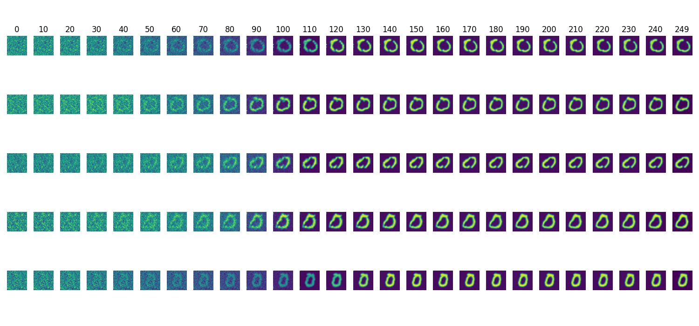

# Diffusion models
by Tim Niklas Witte



A diffusion model was trained on the MNIST dataset to create '0' digits.

# Usage

## Training
Run the `Training.py` to start the training. Tensorboard logs will be stored in `./logs/`.
Besides, the weights of the model will be stored in `./saved_models`.
Note that, the model was already trained for 80 epochs.
For running the training prodecure you need at least 28 GB of RAM.
Otherwise, your system may crash. 
Running the training prodecure with less than this memory requirement can be achieved by removing
the `.cache()` call in the preprocessing pipeline. 
This results slows down training speed significantly.  

```
python3 Training.py
```

## Create an overview of the entire denoising process
By running the `CreateOverview.py` script you can visualize the denoising step in a single plot (see image above)

```
python3 CreateOverview.py
```


## Create for each denoising an image
Run the `CreateImages.py` script. For each denoising step, there will be an image.
It will be stored in `./forward/X.png` where `X` is the current step number.

Example
```
python3 CreateImages.py
```

# Requirements
- TensorFlow 2
- matplotlib
- argparse
- Numpy